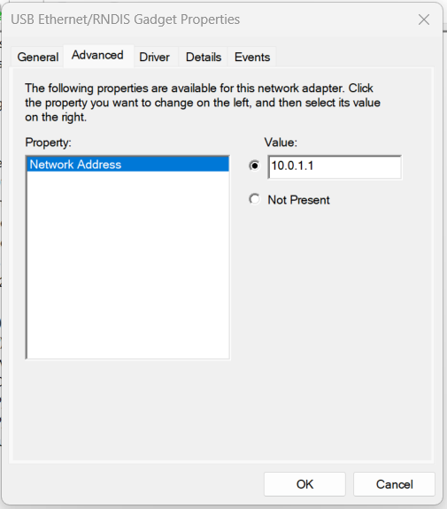
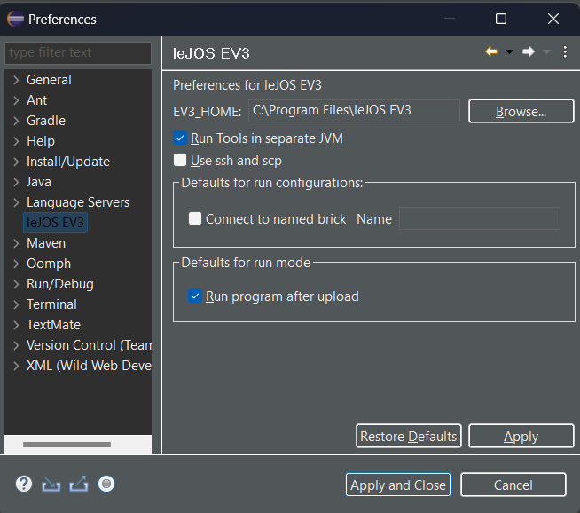

# Setup

Di bawah ini akan disajikan langkah-langkah yang perlu dilakukan untuk setup development environment program Mindstorm EV3 berbasis leJOS.
> Setiap step yang ditunjukkan di bawah ini, diterapkan pada sistem operasi `Windows 11`.

## Setup leJOS ([referensi](https://sourceforge.net/p/lejos/wiki/Windows%20Installation/))

1. Unduh dan Pasang [JDK 7](https://www.oracle.com/java/technologies/javase/javase7-archive-downloads.html)

    Silakan klik link di atas untuk melakukan pengunduhan JDK 7 kemudian lakukan pemasangan pada device Anda.
    > Pada kasus saya menggunakan `Java SE Development Kit 7u80` yang `windows x64`.
    
    Jika sudah diunduh silahkan lakukan step pemasanagn secara normal (next-next saja). Jika sudah berhasil maka akan muncul folder seperti di bawah ini:

    

    > Muncul folder jdk1.7.0_80

2. Persiapkan SD Card dan Card Reader
    
    SD Card ini akan digunakan untuk memasang leJOS EV3 ke dalam EV3 Brick (Mindstorm). Setidaknya kapasitas yang harus tersedia adalah minimal 400 MB.

    

3. Format SD Card

    Pastikan format SD Card adalah FAT32.

    

4. Unduh [JRE Lego](https://www.oracle.com/java/technologies/javaseemeddedev3-downloads.html)

    Silakan klik link di atas untuk melakukan pengunduhan JRE dari Mindstorm EV3. File ini akan digunakan untuk setup runtime environment pada EV3Brick yang memuat image dari SD Card.

    > Pada kasus saya menggunakan `Oracle Java SE Embedded version 7 Update 60`. Hal ini disesuaikan dengan versi JDK yang digunakan ketika membuat image pada SD Card (lihat langkah selanjutnya).

5. Unduh [Installer leJOS](https://sourceforge.net/projects/ev3.lejos.p/files/)

    Silakan unduh installer di atas untuk setup image/firmware pada SD Card.

6. Buat Image/Firmware pada SD Card

    Sebagai catatan sebelum melanjutkan setup image/firmware ini pada SD Card, Anda telah menyiapkan dan menyelesaikan step-step diatas. Jika sudah, Anda bisa mengikuti langkah pada [tutorial utama](https://sourceforge.net/p/lejos/wiki/Windows%20Installation/) dengan poin-poin penting sebagai berikut:

    - Pastikan pemilihan versi JDK sesuai dengan versi JDK yang telah dipasang pada step diatas
    - Ceklis `Additional Sources` pada bagian `Select Components`
    - Ketika sudah selesai, biarkan secara default menjalankan `EV3SDCard Utility`
    - Pada saat window `EV3SDCard Utility`/`EV3 SD Card Creator` muncul silakan: 1. Pilih SD Card yang telah diformat pada step diatas; 2. Biarkan image leJOS EV3 yang sudah terpilih secara default; 3. Pilih file JRE yang telah diunduh sebelumnya; 4. Klik tombol create dan tunggu proses hingga selesai

7. Masukkan SD Card ke EV3 Brick

    Setelah proses setup image/firmware pada SD Card selesai, silakan eject SD Card dan memasangnya pada EV3 Brick.

8. Boot ke SD Card

    Lakukan booting ke SD Card pada EV3 Brick dengan menekan tombol tengah dan menahannya hingga muncul tulisan `Mindstorm starting...`. Kemudian biarkan EV3 Brick menyelesaikan proses pembacaan image (dimulai dengan munculnya logo `leJOS`) yang ada di SD Card. Biasanya proses berjalan selama 8 menit untuk pertama kali booting. 

## Setup IDE ([referensi](https://sourceforge.net/p/lejos/wiki/Installing%20the%20Eclipse%20plugin/))

Pada step kali ini IDE yang akan digunakan adalah sesuai saran dari pengembang leJOS sendiri, yaitu Eclipse IDE. Dimana di dalamnya sudah disediakan plugin untuk mempermudah proses development menggunakan leJOS pada EV3 Brick.

1. Pasang [JDK 19/JDK terbaru](https://www.oracle.com/java/technologies/downloads/#java19)

    Silakan klik link di atas untuk melakukan pengunduhan JDK terbaru kemudian lakukan pemasangan pada device Anda.
    > Pada kasus saya menggunakan `Java SE Development Kit 19` yang `windows x64 installer`.
    
    Jika sudah diunduh silahkan lakukan step pemasanagn secara normal (next-next saja). Jika sudah berhasil maka akan muncul folder seperti di bawah ini:

    

    > Muncul folder jdk 19

2. Unduh [Eclipse Installer](https://www.eclipse.org/downloads/packages/installer)

    Pada tahap ini sebenarnya merupakan preferensi saja, Anda bisa langsung mengunduh IDE yang akan digunakan, yaitu Eclipse IDE for Java Developer. Namun agar lebih mudah, disini kita akan menggunakan Eclipse Installer dan melanjutkan pengunduhan serta pemasangan IDE terkait. 

3. Pasang Eclipse IDE for Java Developer

    Jika installer sudah diunduh, silakan dibuka maka akan muncul window berikut:

    

    Silakan pilih Eclipse IDE for Java Developer

    

    Kemudian pastikan versi JDK yang dipilih adalah sesuai dengan versi yang telah dipasang pada step sebelumnya. Pemilihan ini berdasarkan folder JDK yang terdapat pada Program Files di device Anda. Jika sudah silakan klik `Install` dan tunggu hingga proses pengunduhan dan pemasangan selesai. Kemudian buka Eclipse IDE.

4. Pasang plugin Eclipse leJOS EV3 (melalui repository dengan link http://lejos.sourceforge.net/tools/eclipse/plugin/ev3)

    Ketika Eclipse IDE sudah terbuka, silakan buka menu `Help` dan pilih `Install New Software..`

    

    Akan muncul dialog baru untuk install plugin pada IDE, silakan klik tombol Add yang ada pada bagian `Work with:`

    

    Selanjutnya isikan input Name dengan `leJOS EV3` dan input Location dengan link repository di atas (http://lejos.sourceforge.net/tools/eclipse/plugin/ev3). Jika sudah klik tombol Add.

    

    Ketika telah ditambahkan maka akan muncul daftar Software yang tersedia pada dialog utama tadi. Selanjutnya silakan klik Next dan Finish untuk menyelesaikan penambahan plugin leJOS EV3 pada Eclipse IDE.

    

## Koneksi ke EV3 Brick via USB ([referensi](http://www.java-online.ch/lego/index.php?inhalt_links=home/nav_home.inc.php&inhalt_mitte=ev3install/usb_windows.inc.php&navUSB=ev3install/usb_windows.inc.php))
1. Sambungkan EV3 Brick dengan PC/Laptop melalui USB

    Silakan sambungkan PC Anda dengan EV3 Brick (Micro USB) menggunakan kabel USB to Micro USB.

2. Pasang [RNDIS Driver](http://www.java-online.ch/lego/ev3install/download/rndis.zip) di PC (jika belum terpasang)

    Untuk langkah ini hanya untuk memastikan bahwa RNDIS Driver Anda sudah terinstall atau belum. Anda bisa mengecek terlebih dahulu atau langsung memasang Driver ini (silakan langsung ikuti langkah dibawah gambar berikut ini). Anda bisa mengecek ketersediaan Driver melalui `Device Manager` pada section `Network Adapters` ketika perangkat EV3 Brick sudah terhubung ke PC melalui kabel.
    
    

    Jika driver terkait belum tersedia, silakan unduh RNDIS Driver terlebih dahulu melalui [link ini](http://www.java-online.ch/lego/ev3install/download/rndis.zip) (Windows 10/11) atau [link ini](Windows 8 ke bawah).
    Jika sudah berhasil silakan diekstrak dan cari file `rndis.inf`, lalu klik kanan pada file tersebut dan pilih Install.

3. Atur Alamat IP koneksi (default `10.0.1.1`) untuk RNDIS melalui Device Manager

    Selanjutnya jika Driver sudah terpasang, silakan setup koneksi dengan mengatur IP Address dari EV3 Brick di pengaturan koneksi Driver nya melalui Device Manager.
    
    

    Silakan klik 2 kali pada RNDIS Gadget atau klik kanan lalu pilih `Properties`. Akan muncul dialog Properties RNDIS Gadget, silakan pilih tab `Advanced`.
    
    

    Silakan atur input Value dengan Alamat IP koneksi (default `10.0.1.1`). Terakhir klik Ok.

4. Atur Alamat IP koneksi (default `10.0.1.1`) di plugin Eclipse leJOS EV3 melalui menu Preferences

    Selain pengaturan IP Address di Driver, Anda juga perlu mengatur IP Address koneksi pada Plugin leJOS EV3 yang ada di Eclipse IDE. Silakan buka Eclipse IDE-nya, kemudian buka menu Windows dan pilih `Preferences`
    
    

    Akan muncul dialog Preferences, silakan pilih `leJOS EV3` (nama plugin yang telah kita pasang).
    
    

    Silakan ceklis pada bagian `Connect to named brick` dan isi input-nya dengan IP Address EV3 Brick (default `10.0.1.1`).
    
    

    Terakhir, silakan tekan `Apply and Close` untuk menerapkan konfigurasi IP Address leJOS EV3.

# Referensi
- https://lejos.sourceforge.io/
- http://www.java-online.ch/lego/index.php?inhalt_links=home/nav_home.inc.php&inhalt_mitte=home/home.inc.php
